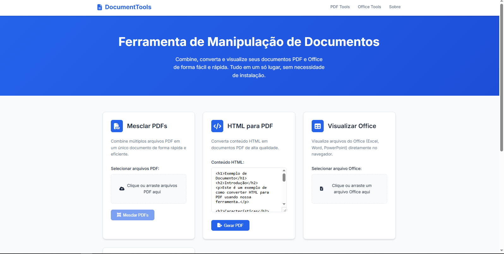

# 📄 Ferramenta de Manipulação de Documentos

Uma aplicação web moderna e responsiva que combina ferramentas poderosas para manipulação de documentos PDF e Office em uma única interface intuitiva.


## 🖼️ Preview da Aplicação



*Interface moderna e intuitiva da Ferramenta de Manipulação de Documentos*

## ✨ Funcionalidades

### 🔗 PDF Tools
- **Mesclar PDFs**: Combine múltiplos arquivos PDF em um único documento
- **HTML para PDF**: Converta conteúdo HTML em documentos PDF de alta qualidade
- **Gerador de Relatórios**: Crie relatórios PDF personalizados com templates

### 📊 Office Tools
- **Visualizador Excel**: Renderize arquivos XLSX/XLS diretamente no navegador
- **Suporte futuro**: Word e PowerPoint (em desenvolvimento)

## 🚀 Como Usar

### Opção 1: Abrir diretamente no navegador
1. Clone ou baixe este repositório
2. Abra o arquivo `index.html` em seu navegador
3. Comece a usar as ferramentas imediatamente!

### Opção 2: Usar servidor local (Recomendado)
```bash
# Instalar dependências (opcional, para desenvolvimento)
npm install

# Iniciar servidor local
npm start
# ou
npm run dev
```

O site será aberto automaticamente em `http://localhost:3000`

## 🎯 Como Usar Cada Ferramenta

### 📋 Mesclar PDFs
1. Clique na área de upload ou arraste múltiplos arquivos PDF
2. Visualize a lista de arquivos selecionados
3. Clique em "Mesclar PDFs"
4. O arquivo mesclado será baixado automaticamente

### 🔄 HTML para PDF
1. Cole ou digite seu conteúdo HTML na área de texto
2. Clique em "Gerar PDF"
3. O documento PDF será gerado e baixado

### 📊 Visualizar Excel
1. Selecione um arquivo XLSX ou XLS
2. O conteúdo será renderizado automaticamente em uma tabela
3. Role horizontalmente para ver todas as colunas

### 📑 Gerar Relatório
1. Digite o título do relatório
2. Adicione o conteúdo desejado
3. Clique em "Gerar Relatório"
4. Um PDF formatado será criado e baixado

## 🛠️ Tecnologias Utilizadas

- **Frontend**: HTML5, CSS3 (Custom Properties), JavaScript ES6+
- **Bibliotecas**:
  - [PDF-lib](https://pdf-lib.js.org/) - Manipulação de PDFs
  - [html2pdf.js](https://github.com/eKoopmans/html2pdf.js) - Conversão HTML para PDF
  - [SheetJS](https://sheetjs.com/) - Processamento de arquivos Excel
  - [Font Awesome](https://fontawesome.com/) - Ícones
  - [Google Fonts](https://fonts.google.com/) - Tipografia (Inter)

## 🎨 Design e UX

- **Design System**: Variáveis CSS customizadas para consistência
- **Responsivo**: Funciona perfeitamente em desktop, tablet e mobile
- **Acessibilidade**: Semântica HTML adequada e contrastes de cor otimizados
- **Interações**: Drag & drop, loading states, feedbacks visuais
- **Temas**: Design moderno com paleta de cores profissional

## 📱 Compatibilidade

- ✅ Chrome 80+
- ✅ Firefox 75+
- ✅ Safari 13+
- ✅ Edge 80+
- ✅ Dispositivos móveis (iOS Safari, Chrome Mobile)

## 🔧 Estrutura do Projeto

```
document-tools/
├── index.html          # Página principal
├── script.js           # Lógica da aplicação
├── package.json        # Dependências e scripts
├── README.md          # Este arquivo
└── assets/            # Recursos adicionais (se necessário)
```

## 🚀 Melhorias Implementadas

### Do Projeto Original PDF-LIB:
- ✅ Interface moderna e responsiva
- ✅ Mesclar múltiplos PDFs (não apenas 2)
- ✅ Melhor feedback visual durante processamento
- ✅ Drag & drop para upload de arquivos
- ✅ Gerador de relatórios com template

### Do Projeto Office Renderer:
- ✅ Design completamente reformulado
- ✅ Melhor renderização de tabelas Excel
- ✅ Suporte a arquivos maiores
- ✅ Interface mais intuitiva
- ✅ Responsividade aprimorada

### Novas Funcionalidades:
- ✅ Navegação suave entre seções
- ✅ Sistema de alertas/notificações
- ✅ Loading states para melhor UX
- ✅ Formatação automática de relatórios
- ✅ Validações de entrada robustas

## 🤝 Contribuindo

1. Faça um fork do projeto
2. Crie uma branch para sua feature (`git checkout -b feature/AmazingFeature`)
3. Commit suas mudanças (`git commit -m 'Add some AmazingFeature'`)
4. Push para a branch (`git push origin feature/AmazingFeature`)
5. Abra um Pull Request

## 📝 Licença

Este projeto está sob a licença MIT. Veja o arquivo [LICENSE](LICENSE) para mais detalhes.

## 👨‍💻 Autor

**Lucio Motta**
- GitHub: [@luciomotta](https://github.com/luciomotta)

## 📈 Roadmap

- [ ] Suporte para arquivos Word (.docx)
- [ ] Suporte para arquivos PowerPoint (.pptx)
- [ ] Editor de PDF avançado
- [ ] Compressão de PDFs
- [ ] Extração de texto de PDFs
- [ ] Modo escuro/claro
- [ ] Salvamento em nuvem
- [ ] API REST para integração

## 🙏 Agradecimentos

- Projeto original PDF-LIB para funcionalidades de PDF
- Projeto original Renderizar-Office-HTML para base do visualizador Office
- Comunidade open source pelas excelentes bibliotecas utilizadas

---

⭐ Se este projeto foi útil para você, considere dar uma estrela!
